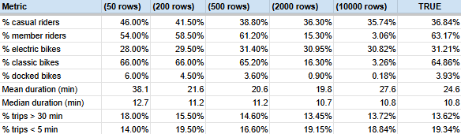

# Probability basics

## 💬Reflection prompts
What’s something you assumed was certain, but wasn’t?

    I might assume that if I study hard for a test, I'll definitely get a high grade. Studying increases the probability of success, but unexpected questions, stress or mistakes can affect the result.

How does knowing probabilities help you plan smarter?

    Probabilities help us estimate risks and outcomes. For example, if rain is in our water forecast for today, bringing an umbrella is a sensible decision even though rain is not guaranteed.

Why might depending only on probability lead to mistakes?

    Probability describes what is likely, not what will definitely happen. Rare events can still occur, so decisions should also consider other factors such as consequences, context and available information.

# Sampling and bias

🧠 Reflection:  
Which result is more useful if you're planning a school snack bar?

    The result from a survey that includes a wide variety of students from different grades, interests and lunch schedules is more useful because it better represents the whole school population.

## 💬 Reflection prompts

- Have you ever made a decision based on incomplete data?

    A common example is buying a product after reading only a few reviews. Later, additional information might reveal issues that were not obvious at first.

- What group might you be **missing** when you gather feedback?

    You might miss people who are absent, less likely to respond. From different age groups or who have different preferences from those who participated.

- How would you redesign Lina’s survey to be more representative?

    I would survey students from different classes and activity groups, and collect responses at different times of the day. Randomly selecting participants would also reduce bias and produce more reliable results.

# Day 3 Task: Probability, Sampling & Fairness

> **Dataset:** Capital Bikeshare — combine 3 months (e.g. July, August, September 2023)  
> **Tool:** Google Sheets  
> **Effort:** ⭐⭐⭐ Medium  
> **Time:** ~4 hours  

> **Link to my Sheet:** [Capital Bikeshare ride data Jul-Sep 2023](https://docs.google.com/spreadsheets/d/1wQU8s1PK47_2W8ibQdQdfDSkr9nB7AbbspJMIZJ_YjY/edit?usp=sharing)

---

## 🗺️ Your Task Map for Today

| Part | Activity | Time |
|------|----------|------|
| Part 0 | Combine 3 months of data | 30 min |
| Part 1 | Probability from real counts | 50 min |
| Part 2 | Independent vs dependent events | 40 min |
| Part 3 | The sampling experiment | 60 min |
| Part 4 | Simulate a biased sample | 45 min |
| Part 5 | Reflection & write-up | 35 min |

---

## 📦 Part 0 — Combine 3 Months of Data (30 min)

Download July, August, and September 2023 from [capitalbikeshare.com/system-data](https://capitalbikeshare.com/system-data).

We can't directly merge large files in Sheets easily, so we'll use a representative approach:

1. Open each CSV file
2. From **each** file, copy the first **20,000 rows** (excluding header) into a new master sheet tab called `all_data`
3. Make sure all three sets have the same columns and paste them one below the other — you should end up with ~60,000 rows total
4. Keep the header row only from the first batch

> 💡 Why 20,000 rows? It keeps Sheets fast while giving us enough volume for sampling to work meaningfully. This is itself a sampling decision — notice that.

Add your `duration_min` column using the Day 2 formula, and apply the same filter (1–180 minutes only). Note your clean row count.

---

## 🎲 Part 1 — Probability from Real Counts (50 min)

In statistics, probability = (number of times something happened) ÷ (total things that could have happened).

Today we calculate **empirical probability** — probability from real observed data, not theory.

### Step 1 — Create a `probabilities` tab

First, record your total clean trip count in a named cell. In cell `A1` type `Total Trips` and in `B1` type:
```
=COUNTA(all_data!A:A)-1
```

### Step 2 — Fill the probability table

For each event, write the COUNTIF/COUNTIFS formula, get the count, and divide by total to get the probability:

| Event | Count Formula | Count | Probability (Count ÷ Total) |
|-------|--------------|-------|-----------------------------|
| Casual rider | `=COUNTIF(all_data!L:L,"casual")` | | |
| Member rider | `=COUNTIF(all_data!L:L,"member")` | | |
| Electric bike | `=COUNTIF(all_data!B:B,"electric_bike")` | | |
| Classic bike | `=COUNTIF(all_data!B:B,"classic_bike")` | | |
| Duration > 30 min | `=COUNTIF(all_data!M:M,">"&30)` | | |
| Duration < 5 min | `=COUNTIF(all_data!M:M,"<"&5)` | | |

Format the Probability column as a percentage: select → Format → Number → Percent (2 decimal places).

### Step 3 — Sanity check

- Do P(casual) + P(member) = 100%? They should — every trip is one or the other.
- Do P(electric) + P(classic) = 100%? Check if there are any other `rideable_type` values in your data.

        Dosen't include docked_bike 3,93 Probability

If they don't add up to exactly 100%, what might explain the gap? Write one sentence.

---

## 🔗 Part 2 — Independent vs Dependent Events (40 min)

Two events are **independent** if knowing one happened tells you nothing about the other. They are **dependent** if knowing one changes the probability of the other.

### Step 1 — Calculate joint and conditional probabilities

We want to know: *Is choosing an electric bike independent of being a casual rider?*

Calculate these four values:

| Probability | Formula | Value |
|------------|---------|-------|
| P(casual) | already done | |
| P(electric bike) | already done | |
| P(casual AND electric) | `=COUNTIFS(all_data!L:L,"casual",all_data!B:B,"electric_bike")/B1` | |
| P(electric \| casual) — "given casual, what % use electric?" | `=COUNTIFS(all_data!L:L,"casual",all_data!B:B,"electric_bike")/COUNTIF(all_data!L:L,"casual")` | |
| P(electric \| member) — "given member, what % use electric?" | `=COUNTIFS(all_data!L:L,"member",all_data!B:B,"electric_bike")/COUNTIF(all_data!L:L,"member")` | |

### Step 2 — The independence test

If electric bike choice were **independent** of rider type, then:
```
P(electric | casual) should equal P(electric | member) should equal P(electric overall)
```

Look at your three values. Are they the same, or does one group prefer electric bikes more than the other?

Answer these questions:

1. Do casual riders and members choose electric bikes at the **same rate**, or is there a difference?

    They choose electric bikes at nearly the **same rate**, 30.24% vs 31.77% a difference of only 1.53 %. This is a very small gap.

2. Based on this, would you say bike type preference is **independent** of rider type, or are they **dependent**? Explain in 2 sentences.

    Bike type preference appears to be essentially independent of rider type. Both groups choose electric bikes at rates very close to the overall rate of 31.21%. Which is exactly what you'd expect if the two variables had no relationship with each other.

3. Why would this matter if Capital Bikeshare wanted to decide how many electric bikes to stock at a station near a tourist area vs a commuter area?

    Because the two groups choose electric bikes at almost identical rates, Only rider type wouldn't be a useful guide for deciding how many electric bikes to stock at tourist vs. commuter stations.

    Capital Bikeshare would need to look at other variables. Like trip duration, time of day to make smarter stocking decisions, since casual vs. member status doesn't meaningfully predict electric bike demand.

### Step 3 — Your own investigation

Pick ONE more pair of variables from the dataset (e.g. duration > 30 min AND casual, or electric bike AND duration < 5 min) and run the same independence test. Report your finding in 2–3 sentences.

    P (Duration > 30 min \ casual) 25.03%
    P (Duration > 30 min \ member) 6.96%
    P (Duration > 30 min overall) 13.62%

    These three values are pretty different. Casual riders take long trips at more than members (25,03% vs 6,96%). Neither of groups is close to the overall rate 13.62%. This means trip duration longer 30 min and rider type are strongly dependent variables. This makes intuitive sense: casual riders are likely tourists or enjoyment cyclists who take long rides. While members are probably commuters making short, purposeful trips on a regular schedule.

---

## 🔬 Part 3 — The Sampling Experiment (60 min)

Here is a crucial real-world question: *If we can't look at all 60,000 trips, how small a sample can we trust?*

### Step 1 — Record the "true" population values

From your full `all_data` tab, note these as your ground truth:

|Metric	 | True Value (all 60k rows)|
|------------|---------|
|% casual riders	 | 36.84%|
|% member riders	 | 63.17%|
|% electric bikes	 | 31.21%|
|% classic bikes	 | 64.86%|
|% docked bikes	 | 3.93%|
|Mean duration (min)	 | 24.6|
|Median duration (min)	 | 10.8|
|% trips > 30 min	 | 13.62%|
|% trips < 5 min	 | 19.34%|

### Step 2 — Set up a sampling sheet

Create a tab called `sampling`. We'll use Google Sheets' `RAND()` function to simulate random sampling.

In your `all_data` tab, add a new column `N` called `random_number`:
```
=RAND()
```
Fill this down for all rows. This assigns a random number between 0 and 1 to every trip.

> ⚠️ Every time the sheet recalculates, RAND() will change! To freeze the numbers: select column N, copy, then Paste Special → Paste values only.

### Step 3 — Extract samples of different sizes

Now sort `all_data` by column N (Data → Sort by column N, ascending). The first 50 rows are now a random sample of 50, the first 200 are a random sample of 200, etc.

For each sample size, calculate your 4 metrics using COUNTIFS limited to that range:

**Example for n=50 (rows 2 to 51):**
```
% casual = COUNTIF(all_data!L2:L51,"casual") / 50 * 100
% electric = COUNTIF(all_data!B2:B51,"electric_bike") / 50 * 100
Mean duration = AVERAGE(all_data!M2:M51)
% > 30 min = COUNTIFS(all_data!M2:M51,">"&30) / 50 * 100
```

Fill in this table:



### Step 4 — Chart the error

In your `sampling` tab, make a line chart showing how the **% casual** estimate changes as sample size grows (x axis = sample size, y axis = % casual). Add a horizontal reference line for the true value.

> In Sheets: plot your sample sizes and % casual values → Insert → Chart → Line chart. To add the true-value line, add a third column with the true % repeated for all rows, then add it as a second series.

### Step 5 — Answer these questions

1. At what sample size does the % casual estimate get within **2 percentage points** of the true value?

The estimate first lands within 2 percentage points at 2,000 rows. 

2. The n=50 sample might look quite wrong. If a journalist used an n=50 survey to report on bikeshare habits, what could go wrong?

The journalist would report that 46% of riders are casual when the true figure is 36.84% — a nearly 10-point overestimate. This could lead to misleading headlines like "Nearly half of bikeshare users are tourists", causing Capital Bikeshare to over invest in tourist friendly infrastructure and underserve their actual majority regular members.

3. In your own words: what is the relationship between **sample size and accuracy**? Write 2–3 sentences.

Small samples are vulnerable to chance a lucky draw of unusual riders can wildly skew the result. Beyond a certain point (here around 2000 rows), the gains in accuracy start to level off, which is why researchers look for a "good enough" threshold rather than always collecting more data.

---

## 🚨 Part 4 — Simulate a Biased Sample (45 min)

A large sample is not automatically trustworthy. A biased sample — even a huge one — can mislead.

### The scenario

A city researcher wants to understand "typical" Capital Bikeshare behaviour. They collect data by **only looking at trips that start between 7–9 AM on weekdays.** This seems reasonable — those are busy hours.

### Step 1 — Add helper columns to `all_data`

Add a column `O` called `hour_of_day`:
```
=HOUR(TIMEVALUE(MID(C2,12,8)))
```

Add a column `P` called `day_of_week_num`:
```
=WEEKDAY(DATEVALUE(MID(C2,1,10)),2)
```
This returns 1=Monday through 7=Sunday.

Fill both down for all rows.

### Step 2 — Create the biased sample

In a new tab called `biased_sample`, pull only the rows where:
- `hour_of_day` is 7 or 8 (7 AM to 9 AM)
- `day_of_week_num` is 1–5 (Monday to Friday)

Since we can't easily do this with formulas on 60k rows in Sheets, use **Filters** instead:

1. Go to `all_data`
2. Data → Create a filter
3. Filter column `O` (hour): show only 7 and 8
4. Filter column `P` (weekday): show only 1, 2, 3, 4, 5

Now calculate the same 4 metrics on the *visible* (filtered) rows and fill in:

Metric	Biased Sample (7–9 AM weekdays)	True Value (all data)	Difference
% casual	23.97%	36.84%	-12.86%
% electric	26.14%	31.21%	-5.07%
Mean duration	14.81	24.58	-9.78
% > 30 min	6.07%	13.62%	-7.55%

### Step 3 — Interpret the bias

Answer these questions:

1. How does the % casual rider compare between the biased sample and the full dataset? Why does this happen — who *isn't* riding at 7–9 AM on weekdays?
% casual	23.97%	VS 36.84%	is -12.86% Difference
Casual riders are heavily underrepresented because 7-9 AM weekdays is prime commuter time. The people not riding at this hour are tourists and anyone without a 9-to-5 schedule. Exactly the casual rider profile. Members dominate this window because they use bikeshare as a daily transport tool.

2. How does the mean duration compare? Why might morning commute trips be shorter or longer than average?

Mean duration: 14.81 vs 24.58 min (−9.78 min)
Morning commute trips are much shorter because commuters ride fixed, optimised routes and repeated every day. They've already found the fastest path. Casual riders by contrast explore, take detours, or ride for fun with no destination pressure.

3. Name **two groups of real bikeshare users** who are effectively invisible in this biased sample.

Tourists and leisure riders, they ride midday, afternoons and weekends, almost never at 7 AM on a Tuesday
Evening & night commuters and shift workers the people commuting to hospitality, healthcare or retail jobs. Who start work at 10 AM, 2 PM, or later

4. If the city used this biased sample to plan new stations, what type of neighbourhood might be unfairly over-prioritised? Under-prioritised?

Over-prioritised: Business districts, office corridors, metro-adjacent commuter hubs
Under-prioritised: Tourist areas, parks, waterfronts, residential leisure neighbourhoods, and areas with non-traditional work schedules

### Step 4 — The key insight

Write 2–3 sentences finishing this thought: *"A large biased sample is more dangerous than a small random sample because..."*

A large biased sample is more dangerous than a small random sample because... its size creates an illusion of reliability. The numbers look stable and confident, so who make a decision trust them without question. A small random sample at least captures the full diversity of users proportionally, even if imprecisely. A large biased sample gives you a very accurate picture of the wrong population, and the bigger it gets, the more convincingly wrong it becomes.

---

## ✍️ Part 5 — Reflection & Write-Up (35 min)

### Final reflection questions

Answer these in a tab called `day3_writeup`:

1. **The news story test:** A reporter writes: *"Survey of 10,000 bikeshare rides shows most users prefer classic bikes."* You find out all 10,000 rides were recorded at a single tourist-area station on summer weekends. What is wrong with this headline — and what would a fair headline say?

The sample is entirely from one tourist-area station on summer weekends a setting where casual, leisure riders dominate and are far more likely to pick classic bikes for a slow scenic ride. Members, commuters are completely absent. A large sample size does not fix a biased collection method. It only makes the biased result look more credible.

A fair headline would say: "Weekend tourists at one bikeshare station favour classic bikes. Broader rider survey needed before citywide conclusions."

2. **The policy risk:** Capital Bikeshare is deciding how many electric bikes to stock across the city. They can only survey riders at 5 stations. Which 5 stations should they choose, and how should they choose them, to get a fair picture? Write a short recommendation (3–4 sentences).

Capital Bikeshare should choose stations that represent the full diversity of their ridership, not just convenient or high-traffic locations. A fair selection would include one station in a dense commuter corridor (near a railway station), one in a tourist area (near the park), one in a residential neighbourhood, one near a university and one in downtown. The goal is to capture different rider types, trip purposes, and times of use. Because electric bike demand likely varies across all of these. Choosing only the busiest or most central stations would oversample members and commuters, just like the 7–9 AM weekday bias we found earlier.

3. **Random vs biased:** In your own words (3–4 sentences), explain the difference between a random sample and a biased sample to someone who has never studied statistics. Use an example from this dataset.

A random sample is like putting every bikeshare trip into a hat and pulling out a handful. Every trip has an equal chance of being picked, so you naturally get a mix of commuters, tourists, short rides, long rides, and all times of day. A biased sample is like chose one tool from the toolbox. The trips that happen to sit there (all 7–9 AM weekday rides) get picked every time, and everything else stays buried. In our dataset, the morning commuter sample gave us only 24% casual riders when the true figure is 37% not because we had too little data, but because we collected it in a way that systematically excluded an entire type of rider.

---

## ✅ Deliverables Checklist

- [x] `all_data` tab with ~60,000 combined rows and `duration_min` column
- [x]  `probabilities` tab with full probability table and sanity check
- [x]  Independence test for electric bike vs rider type completed
- [x]  Your own independence test (one extra pair of variables)
- [x]  True population values recorded
- [x]  `random_number` column added and frozen (paste values)
- [x]  Sampling experiment table filled for all 5 sample sizes
- [x]  Line chart showing % casual estimate vs sample size
- [x]  3 sampling accuracy questions answered
- [x]  Helper columns (hour, weekday) added
- [x]  Biased sample comparison table complete
- [x]  4 bias interpretation questions answered
- [x]  Final write-up in `day3_writeup` (3 reflection questions)

---

## 💡 Bonus (if you finish early)

Re-run your sampling experiment but this time scramble `RAND()` three separate times (paste values each time to get three different random orderings). Do your n=50 estimates land in the same place each time? What does that tell you about the reliability of small samples? Add a short paragraph to your write-up.

---

> A *random* sample — even a small one — is more trustworthy than a large *biased* one. Where your data comes from matters just as much as how much you have.