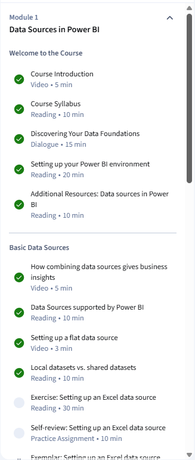

# 📅 Day 1 Task Sheet — Exploring Data Sources in Power BI
### Dataskools | Power BI Programme
**Estimated Time: 6 Hours** | Data Source: Capital Bikeshare

---

## 🗂️ How This Day Is Structured

| Block | Activity | Time |
|---|---|---|
| Block 1 | Coursera Videos + Readings | 1.5 hrs |
| Block 2 | Data Exploration Task | 1.5 hrs |
| Block 3 | Power BI Setup + Connection Task | 1.5 hrs |
| Block 4 | Storage Mode Analysis + Reflection | 1.5 hrs |

> Work through each block in order. Do not skip the reflection questions — they are part of your assessment record.

---

## 📘 Block 1 — Coursera (1.5 Hours)

Complete the following in **Module 1** on Coursera before touching Power BI:

- ✅ Course Introduction (video)
- ✅ Course Syllabus (reading)
- ✅ How to be successful in this course (reading)
- ✅ Reflection: What do you hope to learn? (discussion prompt)
- ✅ Setting up your Power BI environment (reading)
- ✅ New name for Power BI datasets (reading)
- ✅ How to locate your downloaded files (reading)
- ✅ Setting up a flat data source (video)
- ✅ Local vs. shared datasets (reading)
- ✅ Storage modes in Power BI (video)
- ✅ Configuring storage modes (video)
- ✅ Walkthrough: Setting up your storage mode (reading)




**After completing Block 1 — write one sentence answering this before moving on:**
> *"In my own words, the difference between Import and DirectQuery is..."*

Import is ideal for datasets such as statistical sheets that change infrequently *for example, a list of departments and categories, while DirectQuery is intended for large and complex datasets that change every minute or hour *for example, hourly sales data in e-commerce projects.

---

## 🚲 Block 2 — Capital Bikeshare Data Exploration (1.5 Hours)

### What Is Capital Bikeshare?
Capital Bikeshare is Washington D.C.'s public bike sharing system. Every single trip taken is logged and published as open data. It is one of the cleanest, most realistic public datasets available for learning data analysis.

### Step 1 — Download The Data (15 mins)

Go to: **https://capitalbikeshare.com/system-data**

Download the following files:
- Any **one monthly trip data CSV** from 2026 (e.g. 202609-capitalbikeshare-tripdata.csv)
- Any **one monthly trip data CSV** from a different month in 2026

Save both files to a dedicated folder on your computer called:
```
/Documents/Dataskools/Day1/
```

> **Why two files?** You will use them later to practice Append — combining two months into one dataset. Keep this in mind as you explore.

---

### Step 2 — Open And Inspect The CSV (30 mins)

Open **both CSV files in Excel** before touching Power BI. For each file answer the following in your notes:

**File Inspection Checklist:**

| Question | File 1 Answer | File 2 Answer |
|---|---|---|
| How many rows does this file have? | 604566 | 592556 |
| How many columns does this file have? |13 | 13 |
| What is the first column name? | ride_id | ride_id |
| What is the last column name? | member_casual | member_casual |
| Are column names identical across both files? | Y | Y |
| Can you spot any blank or missing cells? | X | X |
| What data type should `started_at` be? | Datetime DD.MM.YYYY HH:MM:SS| date DD.MM.YYYY HH:MM:SS |
| What data type should `duration` be? | Number | Number |

> This step simulates what a real analyst does before connecting any source to Power BI. Never connect data you have not first looked at manually.

---

### Step 3 — Classify The Columns (30 mins)

Using your inspection above, classify every column in the dataset using this table. Fill it in your notes:

| Column Name | Data Type It Should Be | Structured or Unstructured? | Notes |
|---|---|---|---|
| ride_id | String | Structured | has letters and numbers inside|
| rideable_type | String | Structured | Category |
| started_at | Datetime | Structured | |
| ended_at | Datetime | Structured | |
| start_station_name | String | Unstructured | Can include blanks and mistakes|
| start_station_id | Number | Structured | |
| end_station_name | String | Unstructured | Can include blanks and mistakes|
| end_station_id | Number | Structured | |
| start_lat | Decimal Degrees | Structured | |
| start_lng | Decimal Degrees | Structured | |
| end_lat | Decimal Degrees | Structured | |
| end_lng | Decimal Degrees | Structured | |
| member_casual | String | Structured | Category |

> **Tip:** Ask yourself — is this column a category, a number, a date, or a location? That question maps directly to Power BI data types you will set in tomorrow's session.

---

### Step 4 — Block 2 Reflection Questions (15 mins)

Write your answers in your learning journal or notes document. Minimum 2–3 sentences per answer.

**Q1:** Looking at the Capital Bikeshare CSV — is this flat data or structured data? Explain your reasoning using specific column names as evidence.

Flat means everything about one ride is in one row and nothing is hidden in other tables. Predictable type: ride_id is always a string, started_at is always a datetime, member_casual is always one of two. 

**Q2:** The `started_at` and `ended_at` columns contain timestamps. What business questions could you answer if you correctly formatted these as date/time columns in Power BI?

Can we calculate how long each ride lasted? Can we see which hours of the day are busiest? Can we compare weekdays vs weekends, monts vs other months?

**Q3:** You have two monthly files with identical column structures. Before combining them — what would you check to make sure an Append operation would work correctly?

1. Are both files have the exact same column names?
2. Are the column types match?
3. Are there are no duplicate ride_id values across both files?  *no ride gets counted twice

**Q4:** The `start_station_name` column contains free text station names. What problems might this create when trying to group or filter data in a report?

If one of rows have double space, symbhol or a typo then Power BI thinks these are two different stations. That breaks our grouping. Better to use start_station_id for grouping.

---

## ⚙️ Block 3 — Power BI Setup + Connection Task (1.5 Hours)

### Step 1 — Install And Open Power BI Desktop (15 mins)

If not already installed:
- Go to **https://powerbi.microsoft.com/desktop**
- Download and install Power BI Desktop (free)
- Open the application and dismiss the welcome screen

---

### Step 2 — Connect Your First CSV File (30 mins)

Connect the **first** Capital Bikeshare CSV file to Power BI:

1. Click **Home → Get Data → Text/CSV**
2. Navigate to your `/Documents/Dataskools/Day1/` folder
3. Select your first monthly file
4. In the preview window — observe what Power BI detects automatically
5. Click **Transform Data** (do not click Load yet)

**Inside Power Query — observe and record the following:**

| Observation | What You See |
|---|---|
| How many columns did Power BI detect? | 13 |
| What data type did Power BI assign to `started_at`? | Date/Time |
| What data type did Power BI assign to `start_lat`? | Decimal number |
| Is `member_casual` detected as Text or something else? | Text |
| Are there any error flags visible in the column headers? | No |

> **Important:** Do not make any changes yet. This is purely observation. You are building the habit of looking before transforming.

---

### Step 3 — Connect The Second CSV File (20 mins)

Without closing the first query:

1. Click **Home → New Source → Text/CSV**
2. Connect your second monthly file
3. Observe whether Power BI assigns the same data types automatically
4. Compare the Applied Steps list for both queries side by side

**Record any differences you notice between the two auto-detected queries.**

end_station_name, end_station_id, end_lat, end_lng has some empty rows

---

### Step 4 — Rename Your Queries (10 mins)

In the Queries panel on the left:
- Rename the first query to: `Trips_Month1`
- Rename the second query to: `Trips_Month2`

> Naming conventions matter in professional Power BI work. Every query, column, and measure should have a clear, consistent name before the file is shared with anyone.

---

### Step 5 — Close And Apply (15 mins)

Click **Close & Apply** to load both tables into the Power BI data model.

Once loaded:
- Click the **Data view** (table icon on the left sidebar)
- Confirm both tables are visible
- Check the row count shown at the bottom of each table
- Compare to the row counts you recorded in Block 2

**If the row counts match — your connection is clean.** 
**If they do not match — record the difference and note a possible reason why.** -1 because of header

---

## 🧠 Block 4 — Storage Mode Analysis + Final Reflection (1.5 Hours)

### Step 1 — Storage Mode Decision Exercise (30 mins)

Read each business scenario below. For each one decide which storage mode is most appropriate and write your justification. Use what you learned in the Coursera videos.

**Scenario A:**
A retail company exports weekly sales data from their ERP system as a CSV file every Monday morning. The Power BI report only needs to be refreshed once per week after the new file arrives.
> Which storage mode? Why?

Import loads the CSV into Power BI's memory, which makes the report fast and doesn't require the ERP system to be available when people are viewing the report. You just schedule a refresh. 

**Scenario B:**
A hospital needs a live dashboard showing patient bed occupancy updated every 5 minutes from a SQL database. Report users need to see the current state at all times.
> Which storage mode? Why?

DirectQuery sends a live query to the SQL database every time someone opens or refreshes the report, so users always see the current state.

**Scenario C:**
A logistics company has 500 million rows of historical shipment data in a cloud database. Analysts need both historical trend analysis and occasional live lookups. Performance is critical.
> Which storage mode? Why?

DirectQuery on that scale would be slow for trend analysis. Composite mode would solve this. We can Import the historical aggregated data (fast for trend charts) and use DirectQuery only for the live lookup part.

**Scenario D:**
A small NGO uses a single Excel file maintained by one person to track donor contributions. The Power BI report is shared with the board once per month.
> Which storage mode? Why?

Import is perfect here. The report will be fast, works even if the Excel file is closed or offline, and a manual refresh once a month before the meeting is all that's needed. 

---

### Step 2 — Apply Storage Mode To Your Bikeshare Data (20 mins)

Back in Power BI Desktop:

1. Go to **Model view** (diagram icon on left sidebar)
2. Click on the `Trips_Month1` table
3. In the Properties panel on the right find **Storage Mode**
4. Observe what mode Power BI defaulted to
5. Do the same for `Trips_Month2`

**Answer in your notes:**
- What storage mode was applied automatically?
  Import.
- Is this the right mode for this dataset given it is a static CSV file?
  Yes, we have historical data in csv files. We do not have updated info in our data.
- What would change if this were a live feed from Capital Bikeshare's API instead?
    A "live feed" for history of rides is pretty unusual. Collected info for previos period usualy don't update. So before changing anything, the right question is why we need a live feed? For current month, week, day, hour it make sense but for previous colected data it no sense to do.

---

### Step 3 — Final Reflection Questions (40 mins)

These are your end of day consolidation questions. Write minimum 3–4 sentences per answer. These responses form part of your portfolio evidence.

**Q1 — Data Sources:**
Capital Bikeshare publishes data as CSV files. Name two other data source types Power BI can connect to and explain one advantage each has over a flat CSV file for business reporting.

**Q2 — Flat vs Structured:**
The bikeshare CSV is a flat file. Describe what a structured version of this same data might look like if it were stored in a relational database. What tables would exist and how would they relate to each other?

**Q3 — Storage Mode:**
You connected two CSV files today using Import mode. Write a short paragraph explaining to a non-technical manager why the choice of storage mode matters for report performance and data freshness.

**Q4 — Real World Connection:**
Think about a business or organisation you are familiar with — your previous job, a family business, or a local service. Identify at least two data sources that business generates daily. Which Power BI connectors might connect to those sources? Which storage mode would you recommend and why?

**Q5 — Personal Learning:**
What was the single most surprising thing you discovered today — either about Power BI, about the Capital Bikeshare data, or about how data is structured in real datasets? Why did it surprise you?

---

## ✅ Day 1 Completion Checklist

Before marking Day 1 complete confirm you have:

- [X] Completed all Coursera Module 1 items listed in Block 1
- [X] Downloaded two Capital Bikeshare CSV files
- [X] Completed the File Inspection Checklist for both files
- [X] Classified all 13 columns with data types
- [X] Connected both CSVs to Power BI Desktop
- [X] Renamed both queries correctly
- [X] Confirmed row counts match between Excel and Power BI
- [X] Completed the Storage Mode Decision Exercise for all 4 scenarios
- [ ] Written full answers to all 5 Final Reflection Questions

---

## 📁 Files To Save After Day 1

Save the following to `/Documents/Dataskools/Day1/`:

| File | Description |
|---|---|
| `09-capitalbikeshare-tripdata.csv` | First monthly source file |
| `10-capitalbikeshare-tripdata.csv` | Second monthly source file |
| `Day1_PowerBI.pbix` | Your Power BI Desktop file |
| `Day1_Notes.docx` | All inspection tables and reflection answers |

> You will use these files again on Day 2 and Day 3. Keep them organised.
